  <h3>              Java Backend Developer | Spring Boot | Microservices | Kafka | Cloud | AI</h3>

Building scalable backend applications with Java, Spring Boot, and modern cloud technologies.

<table>
<tr>

<td valign="top" align="center" width="35%">

</td>

<td valign="top" align="center" width="65%">

</td>

</tr>

</table>

 

## 👨‍💻 About Me

- 🎓 B.Tech Computer Science Graduate
- 💼 Aspiring Java Backend Developer
- 🌱 Currently learning Kafka, Redis and Distributed Systems
- 🤖 Exploring Generative AI and LLM APIs
- ☁️ Interested in Cloud-Native Backend Development
- 🚀 Looking for Java Backend Developer opportunities

## 🛠 Tech Stack

 

## 🚀 Featured Projects

<table>

<tr>

<td width="50%">

<h3>📘 Journal Management System</h3>

Secure backend application built with Java and Spring Boot.

**Tech Stack**

- Java
- Spring Boot
- Spring Security
- JWT
- MongoDB
- REST APIs

</td>

<td width="50%">

<h3>🔗 <a href="https://github.com/birajkushwaha/Url_Shortner">URL Shortener</a></h3>

Scalable URL shortening service with Docker support.

**Tech Stack**

- Java
- Spring Boot
- MySQL
- Docker
- REST APIs

</td>

</tr>

<tr>

<td width="50%">

<h3>🤟 <a href="https://github.com/birajkushwaha/TwoSign-Two-way-communicator">Signify AI</a></h3>

AI-powered sign language recognition system.

**Tech Stack**

- Python
- TensorFlow
- OpenCV
- MediaPipe

</td>

<td width="50%">

<h3>🚀 More Projects</h3>

Visit my repositories for additional backend and AI projects.

</td>

</tr>

</table>
 

## 📫 Connect With Me

&nbsp;&nbsp;

&nbsp;&nbsp;

 

